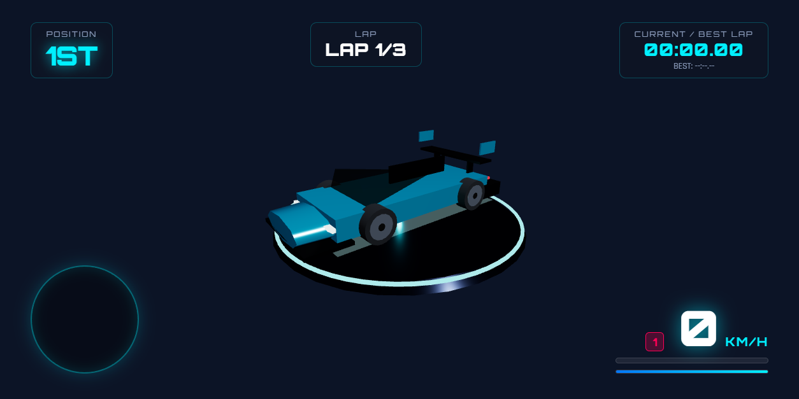

# 🏎️ HYPERDRIFT 3D

A fast-paced, high-octane 3D arcade racing game built with Three.js, procedural circuit generation, dynamic vehicle physics, and real-time WebRTC multiplayer.



---

## ✨ Features

- **🏎️ High-Fidelity Hypercars**:
  - **Apex Phantom**: Le Mans-style aerodynamic prototype with 5-spoke lightweight alloy wheels, acid-yellow Brembo calipers, dual white racing stripes, active rear wing, and blue titanium exhaust tips.
  - **Vortex GT**: Aggressive widebody drift beast with deep-dish bronze alloy rims, crimson Brembo calipers, vented carbon hood, front canards, and swan-neck GT racing wing.
  - Multi-tone neon livery finishes with realistic clearcoat reflections.
- **🛣️ Infinite Procedural Circuits**:
  - Seed-based track generator creating endless banked curves, straights, elevation changes, neon arches, and futuristic synthwave cityscapes.
- **⚡ Dynamic Track Features**:
  - On-track neon chevron boost pads providing smooth forward surges and nitro refills.
  - Wall collision physics with spark particle bursts and speed-reducing barriers.
  - Radial warp speed lines and aerodynamic wind rush audio scaling at high speeds.
- **🎮 Smooth Precision Handling**:
  - Calibrated arcade GT physics with realistic drift angles and counter-steering.
  - In-game real-time steering sensitivity slider (0.5x – 1.8x).
- **🌐 Real-Time Multiplayer**:
  - Peer-to-peer online racing via WebRTC (PeerJS).
  - Instant room creation with shareable codes.
- **🎵 Dynamic Audio Synthesizer**:
  - Procedural Web Audio engine sounds, turbo blow-off flutter, tire screech, wind rush, and synthwave soundtrack with in-game mute toggle.

---

## 🕹️ Controls

| Action | Primary Key | Alternate Key |
|---|---|---|
| **Accelerate** | `W` | `Up Arrow` |
| **Brake / Reverse** | `S` | `Down Arrow` |
| **Steer Left / Right** | `A` / `D` | `Left` / `Right Arrow` |
| **Nitro Boost** | `SPACE` | `Shift` / `E` |
| **Reset Car** | `R` | — |

---

## 🚀 How to Run Locally

### Requirements
- Python 3.8+ (no external pip packages required)
- Any modern web browser (Edge, Chrome, Firefox, Brave)

### Start the Game
1. Clone this repository:
   ```bash
   git clone https://github.com/KaranPareekk/hyper-drift-3d.git
   cd hyper-drift-3d
   ```
2. Start the local server:
   ```bash
   python server.py
   ```
3. Open your browser and navigate to:
   ```
   http://localhost:8000
   ```

Or on Windows, simply double-click `START_GAME.bat` or the desktop shortcut!

---

## 🛠️ Tech Stack
- **Engine**: [Three.js](https://threejs.org/) (WebGL / WebGPU ready)
- **Networking**: [PeerJS](https://peerjs.com/) (WebRTC DataChannels)
- **Audio**: Web Audio API (procedural oscillator + white noise synthesis)
- **Backend**: Python HTTP Server

---

## 📄 License
MIT License. Free to use, modify, and distribute.
